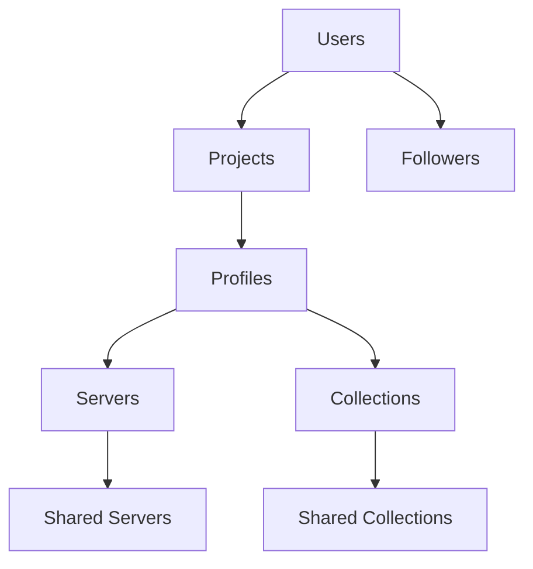

# Contributing to Plugged.in

Welcome to Plugged.in! We're excited to have you contribute to the leading social platform for the Model Context Protocol (MCP) ecosystem. This guide will help you understand our project structure, development patterns, and contribution process.

## Table of Contents

1. [Project Overview](#project-overview)
2. [Getting Started](#getting-started)
3. [Project Structure](#project-structure)
4. [Development Patterns](#development-patterns)
5. [Contributing Guidelines](#contributing-guidelines)
6. [Code Standards](#code-standards)
7. [Testing](#testing)
8. [Documentation](#documentation)
9. [Security](#security)
10. [Internationalization](#internationalization)
11. [Database Changes](#database-changes)
12. [Memory Bank System](#memory-bank-system)

## Project Overview

Plugged.in is a collaborative social platform for managing, sharing, and discovering MCP servers and collections. The project consists of two main repositories:

- **pluggedin-app**: Next.js 14/React 19 web application with social features
- **pluggedin-mcp**: TypeScript-based MCP proxy server

### Key Features
- Social platform with user profiles and following system
- MCP server and collection sharing
- Internationalization (6 languages: en, tr, zh, hi, ja, nl)
- Interactive playground with RAG integration
- Resource management with templates and notes
- Comprehensive security and rate limiting

## Getting Started

### Prerequisites
- Node.js 18.17.0+
- PostgreSQL 14+
- pnpm 8.6.0+
- Git

### Development Setup

1. **Clone the repository**
   ```bash
   git clone <repository-url>
   cd pluggedin-app
   ```

2. **Install dependencies**
   ```bash
   pnpm install
   ```

3. **Environment setup**
   ```bash
   cp .env.example .env
   # Edit .env with your database URL and other settings
   ```

4. **Generate encryption key**
   ```bash
   pnpm run generate-encryption-key
   # Add the output to .env as NEXTAUTH_SECRET
   ```

5. **Database setup**
   ```bash
   pnpm db:generate
   pnpm db:migrate
   ```

6. **Start development server**
   ```bash
   pnpm dev
   ```

## Project Structure

### Directory Layout
```
pluggedin-app/
├── app/                     # Next.js App Router
│   ├── (auth)/             # Authentication pages
│   ├── (sidebar-layout)/   # Main app layout
│   ├── actions/            # Server Actions
│   └── api/                # API Routes
├── components/             # React components
│   ├── ui/                # Shadcn/ui components
│   ├── auth/              # Authentication components
│   ├── profile/           # Profile-related components
│   └── settings/          # Settings components
├── db/                    # Database schema & utils
├── hooks/                 # Custom React hooks
├── i18n/                  # Internationalization config
├── lib/                   # Utility libraries
├── memory-bank/           # Project documentation
├── public/locales/        # Translation files
└── types/                 # TypeScript type definitions
```

### Key Architecture Patterns

#### User-Centric Social Model
- Users table stores core identity and social fields
- Following relationships are user-to-user (not profile-based)
- Profiles organize servers/workspaces within projects
- Sharing occurs at the profile level but discovery is user-centric

#### Database Schema


## Development Patterns

### Frontend Patterns
- **React Server Components**: Use for data fetching and server-side rendering
- **Server Actions**: Use for all mutations (create, update, delete, follow, share)
- **SWR**: Use for client-side data fetching and caching
- **TypeScript**: Maintain strict type safety throughout
- **Tailwind CSS**: Use for all styling

### Backend Patterns
- **Server Actions**: Primary method for mutations with type safety
- **API Routes**: Use for queries, search, and webhook endpoints
- **Drizzle ORM**: Type-safe database operations
- **Rate Limiting**: Implemented across all endpoints with tiered limits

### Authentication & Authorization
- **NextAuth.js**: Handles sessions and authentication
- **Resource Ownership**: Users own Projects → Profiles → Servers/Collections
- **Sharing Logic**: Public/private flags with profile-based sharing

## Contributing Guidelines

### Before You Start
1. **Read the Memory Bank**: Always read all files in `memory-bank/` before starting work
2. **Check Active Context**: Review `memory-bank/activeContext.md` for current priorities
3. **Search Issues**: Look for existing issues or discussions on your topic

### Types of Contributions

#### 🐛 Bug Fixes
- Focus on critical and high-priority bugs first
- Include reproduction steps in your PR description
- Add tests to prevent regression

#### ✨ New Features
- Discuss large features in issues before implementing
- Follow established patterns (see `memory-bank/systemPatterns.md`)
- Update documentation and tests
- Consider internationalization needs

#### 📚 Documentation
- Update Memory Bank after significant changes
- Keep README.md current with new features
- Include code examples in documentation

#### 🌍 Internationalization
- All new text must be added to ALL 6 language files
- Use translation keys, never hardcode text
- Test with different languages enabled

### Pull Request Process

1. **Branch Naming**
   ```
   feature/description-of-feature
   fix/description-of-bug
   docs/description-of-docs-change
   ```

2. **Commit Messages**
   ```
   type(scope): description
   
   Examples:
   feat(social): add user profile sharing
   fix(playground): resolve session loss issue
   docs(memory-bank): update active context
   i18n(translations): add missing keys for notifications
   ```

3. **PR Checklist**
   - [ ] Code follows project patterns
   - [ ] Tests added/updated
   - [ ] Documentation updated
   - [ ] Internationalization considered
   - [ ] Memory Bank updated if needed
   - [ ] No security vulnerabilities introduced

## Code Standards

### TypeScript
- Use strict type checking
- Define interfaces for all data structures
- Use Zod for runtime validation
- Avoid `any` types

### React Components
- Use functional components with hooks
- Follow Server Component patterns where appropriate
- Use `useTranslation` hook for all text
- Implement proper error boundaries

### Database Operations
- Use Drizzle ORM for type safety
- Follow existing schema patterns
- Include migrations for schema changes
- Use transactions for complex operations

### API Design
- Use Server Actions for mutations
- Implement proper error handling with `lib/api-errors.ts`
- Include input validation with Zod
- Follow rate limiting patterns

## Testing

### Test Types
- **Unit Tests**: For utility functions and components
- **Integration Tests**: For API endpoints and database operations
- **E2E Tests**: For critical user flows

### Running Tests
```bash
# Run all tests
pnpm test

# Run specific test file
pnpm test path/to/test.file.ts

# Run tests in watch mode
pnpm test:watch
```

### Test Standards
- Test critical user flows
- Mock external dependencies
- Use proper test data cleanup
- Include both success and error cases

## Documentation

### Memory Bank System
Our project uses a comprehensive Memory Bank system for documentation:

#### Core Files (Always Update When Relevant)
- `projectbrief.md`: Foundation and goals
- `activeContext.md`: Current work focus and recent changes
- `progress.md`: What works, what's in progress, what's left
- `systemPatterns.md`: Architecture and design patterns
- `techContext.md`: Technology stack and setup
- `productContext.md`: Product vision and user needs

#### Documentation Rules
1. **Always read Memory Bank before starting work**
2. **Update Memory Bank after significant changes**
3. **Keep activeContext.md current with ongoing work**
4. **Document architectural decisions in systemPatterns.md**

### Code Documentation
- Use JSDoc for complex functions
- Include README files for new modules
- Document API endpoints with examples
- Maintain up-to-date type definitions

## Security

### Security Requirements
- **Input Validation**: Use Zod schemas for all inputs
- **Authentication**: Verify user permissions for all operations
- **Rate Limiting**: Implement appropriate limits for all endpoints
- **Error Handling**: Use sanitized error messages
- **Data Privacy**: Ensure users can only access their own data

### Security Review Process
1. Review all data access patterns
2. Validate input sanitization
3. Check authentication/authorization logic
4. Test for common vulnerabilities (OWASP Top 10)
5. Review error message information disclosure

### Reporting Security Issues
- Create a private issue for security vulnerabilities
- Include reproduction steps and impact assessment
- Follow responsible disclosure practices

## Internationalization

### Adding New Text
1. **Never hardcode text** - always use translation keys
2. **Add to ALL languages**: en, tr, zh, hi, ja, nl
3. **Use appropriate namespaces**: common, auth, playground, etc.
4. **Test with different languages** enabled

### Translation File Structure
```
public/locales/
├── en/
│   ├── common.json
│   ├── auth.json
│   ├── playground.json
│   └── ...
├── tr/
├── zh/
├── hi/
├── ja/
└── nl/
```

### Translation Guidelines
- Use descriptive keys: `profile.settings.username.label`
- Include context in complex translations
- Handle pluralization properly
- Consider cultural differences

## Database Changes

### Schema Changes
1. **Create migration files** in `drizzle/migrations/`
2. **Update schema.ts** with new definitions
3. **Generate Drizzle client**: `pnpm db:generate`
4. **Apply migrations**: `pnpm db:migrate`
5. **Update TypeScript types** as needed

### Migration Best Practices
- Always create reversible migrations
- Test migrations on development data
- Consider data migration needs
- Update seed data if necessary

### Schema Patterns
- Follow existing naming conventions (snake_case for columns)
- Use appropriate constraints and indexes
- Include created_at/updated_at timestamps
- Follow foreign key relationships

## Release Process

### Version Management
- Follow semantic versioning (MAJOR.MINOR.PATCH)
- Update version in package.json
- Create release notes
- Tag releases in Git

### Pre-Release Checklist
- [ ] All tests passing
- [ ] Memory Bank updated
- [ ] Security review completed
- [ ] Performance testing done
- [ ] Documentation updated
- [ ] Translation completeness verified

## Getting Help

### Resources
- **Memory Bank**: Start with `memory-bank/` directory
- **README**: Project setup and features
- **Issues**: Existing problems and discussions
- **Discord/Community**: [Link to community if available]

### Contact
- Create an issue for bugs or feature requests
- Use discussions for questions and ideas
- Tag maintainers for urgent security issues

## Recognition

We appreciate all contributions! Contributors will be:
- Listed in project contributors
- Mentioned in release notes for significant contributions
- Invited to join maintainer discussions for regular contributors

---

Thank you for contributing to Plugged.in! Together, we're building the future of AI collaboration through MCP. 🚀 
