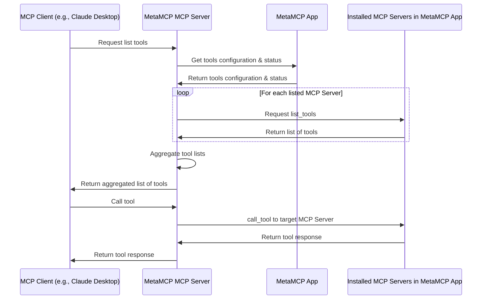

# Plugged.in


https://plugged.in 

Plugged.in is "The One" MCP to manage all your MCPs. It uses a GUI fullstack app (this repo) and a local MCP proxy to achieve this. (see our latest npm repo [pluggedin-mcp](https://github.com/VeriTeknik/pluggedin-mcp))

A few feature highlights:

- GUI app to manage configurations with dynamic updates when `list_tools`, etc.
- Support ANY MCP clients (e.g., Claude Desktop, Cursor, etc.) because Plugged.in is a MCP server.
- Support prompts, resources, tools under MCP.
- Support multi-workspace: e.g., activate a workspace of DB1 or switch to DB2 in another workspace, preventing polluting context of DB1 to your MCP Client.

The app is also self hostable, free and open source. The differences between this repo and cloud version are:

- You can try how this app works using cloud version but I actually encourage you to self host if you are familiar with docker: it will provide unlimited access with lower latency, full private operations on your end.
- Cloud version adds auth and session contexts
- Cloud version provides server side encryption
- Cloud version tweaks a little bit on serverless hosting
- To use it with Smithery MCP hosting, it requires cloud hosted URL (or you can use ngrok etc.)

Check out demo videos at https://plugged.in/. Here is an overview screenshot.


⚠️ Warning: there are some known compatibility issues on Windows depending on the MCP client implementation, refer to https://github.com/metatool-ai/metatool-app/issues/15 for discussion or workaround solutions.

## Architecture Overview

Note that prompts and resources are also covered similar to tools.



## Installation

To get instantly started with cloud version visit https://metamcp.com/.
To get started with this self hostable version of MetaMCP App, the eastiest way is to clone the repository and use Docker Compose to run it.

```bash
git clone https://github.com/metatool-ai/metatool-app.git
cd metatool-app
cp example.env .env
docker compose up --build -d
```

Then open http://localhost:12005 in your browser to open MetaMCP App.

It is recommended to have npx (node.js based mcp) and uvx (python based mcp) installed globally.
To install uv check: https://docs.astral.sh/uv/getting-started/installation/

You also need a MCP Client to connect to `@metamcp/mcp-server-metamcp`. For example if you are using [Claude Desktop](https://modelcontextprotocol.io/quickstart/user), the config json may look like this:

```json
{
  "mcpServers": {
    "PluggedinMCP": {
      "command": "npx",
      "args": ["-y", "@metamcp/mcp-server-metamcp@latest"],
      "env": {
        "METAMCP_API_KEY": "<your api key>",
        "METAMCP_API_BASE_URL": "http://localhost:12005"
      }
    }
  }
}
```

For Cursor, env vars aren't easy to get typed in so you may use args instead

```bash
npx -y @metamcp/mcp-server-metamcp@latest --metamcp-api-key <your-api-key> --metamcp-api-base-url <base-url>
```

You can get the API key from the MetaMCP App's API Keys page.

## Production Deployment

### System Requirements

The Plugged.in service requires:

- Node.js v18+ (recommended v20+)
- PostgreSQL 15+
- PNPM package manager
- Nginx web server
- Systemd (for service management)

### Production Setup

1. Clone the repository:
   ```bash
   git clone https://github.com/VeriTeknik/pluggedin-app.git /home/pluggedin/pluggedin-app
   cd /home/pluggedin/pluggedin-app
   ```

2. Install dependencies:
   ```bash
   pnpm install
   ```

3. Set up environment variables by copying and editing `.env.local.example`:
   ```bash
   cp .env.local.example .env
   # Edit .env with your specific configuration
   ```

4. Run database migrations:
   ```bash
   pnpm db:migrate:auth
   pnpm db:generate
   pnpm db:migrate
   ```

5. Build the application for production:
   ```bash
   NODE_ENV=production pnpm build
   ```

### Security Considerations

**MCP Server Sandboxing (Linux/Ubuntu)**

- **Problem:** STDIO-based MCP servers are executed as child processes. Without sandboxing, they inherit the permissions of the main application, potentially allowing unrestricted filesystem access, which poses a significant security risk.
- **Solution:** This application automatically wraps the execution of STDIO MCP servers with `firejail --quiet` when running on a Linux system. This utilizes Firejail's default security profile to restrict the server's capabilities, notably limiting filesystem access.
- **Requirement:** The `firejail` package **must be installed** on the Ubuntu/Linux production server for this sandboxing to be effective. You can typically install it using:
  ```bash
  sudo apt update && sudo apt install firejail
  ```
- **Note:** This sandboxing is applied automatically within the application logic (`app/actions/mcp-playground.ts`) and does not require manual configuration per server. SSE servers are not affected by this specific sandboxing mechanism.

### Service Configuration

Create a systemd service file at `/etc/systemd/system/pluggedin.service`:

```
[Unit]
Description=Plugged.in Application Service
After=network.target postgresql.service
Wants=postgresql.service

[Service]
User=pluggedin
Group=pluggedin
WorkingDirectory=/home/pluggedin/pluggedin-app
ExecStart=/usr/bin/pnpm start
Restart=always
RestartSec=10
StartLimitInterval=60
StartLimitBurst=3
StandardOutput=append:/var/log/pluggedin/pluggedin_app.log
StandardError=append:/var/log/pluggedin/pluggedin_app.log
Environment=PATH=/usr/bin:/usr/local/bin
Environment=NODE_ENV=production
Environment=PORT=12005

# Service timeouts
TimeoutStartSec=30
TimeoutStopSec=30

[Install]
WantedBy=multi-user.target
```

### Nginx Configuration

1. Create the Nginx configuration file at `/etc/nginx/sites-available/plugged.in`:

```
# HTTPS Server
server {
    listen 443 ssl;
    server_name your-domain.com;

    # SSL configuration (using Let's Encrypt)
    ssl_certificate /etc/letsencrypt/live/your-domain.com/fullchain.pem;
    ssl_certificate_key /etc/letsencrypt/live/your-domain.com/privkey.pem;
    include /etc/letsencrypt/options-ssl-nginx.conf;
    ssl_dhparam /etc/letsencrypt/ssl-dhparams.pem;

    # Next.js static files
    location /_next/static/ {
        alias /home/pluggedin/pluggedin-app/.next/static/;
        expires 365d;
        access_log off;
        add_header Cache-Control "public, max-age=31536000, immutable";
        
        # Fix MIME type issues
        include /etc/nginx/mime.types;
        default_type application/octet-stream;
        
        # Enable compression
        gzip on;
        gzip_vary on;
        gzip_min_length 10240;
        gzip_proxied any;
        gzip_types text/plain text/css text/xml text/javascript application/x-javascript application/xml application/javascript;
    }

    # Proxy settings for Node.js application
    location / {
        proxy_pass http://localhost:12005;
        proxy_http_version 1.1;
        proxy_set_header Upgrade $http_upgrade;
        proxy_set_header Connection 'upgrade';
        proxy_set_header Host $host;
        proxy_cache_bypass $http_upgrade;
        proxy_set_header X-Real-IP $remote_addr;
        proxy_set_header X-Forwarded-For $proxy_add_x_forwarded_for;
        proxy_set_header X-Forwarded-Proto $scheme;
        
        # Additional headers for OAuth
        proxy_set_header X-Forwarded-Host $host;
        proxy_set_header X-Forwarded-Port $server_port;
        
        # Increase timeout for OAuth redirects
        proxy_connect_timeout 300s;
        proxy_send_timeout 300s;
        proxy_read_timeout 300s;
    }
}

# HTTP redirect to HTTPS
server {
    listen 80;
    server_name your-domain.com;
    return 301 https://$host$request_uri;
}
```

2. Enable the site and update nginx to run as the pluggedin user:

```bash
# Create symbolic link
sudo ln -s /etc/nginx/sites-available/plugged.in /etc/nginx/sites-enabled/

# Update nginx.conf to run as pluggedin user
sudo sed -i 's/user www-data;/user pluggedin;/' /etc/nginx/nginx.conf

# Test and restart nginx
sudo nginx -t
sudo systemctl restart nginx
```

### Starting the Service

1. Create required directories:
   ```bash
   sudo mkdir -p /var/log/pluggedin
   sudo chown -R pluggedin:pluggedin /var/log/pluggedin
   ```

2. Enable and start the service:
   ```bash
   sudo systemctl daemon-reload
   sudo systemctl enable pluggedin.service
   sudo systemctl start pluggedin.service
   ```

3. Check the service status:
   ```bash
   sudo systemctl status pluggedin.service
   ```

### Service Management Commands

#### Starting the Service
```bash
sudo systemctl start pluggedin.service
```

#### Stopping the Service
```bash
sudo systemctl stop pluggedin.service
```

#### Restarting the Service
```bash
sudo systemctl restart pluggedin.service
```

#### Checking Service Status
```bash
sudo systemctl status pluggedin.service
```

#### Viewing Service Logs
```bash
# View last 100 lines
sudo journalctl -u pluggedin.service -n 100

# Follow logs in real-time
sudo journalctl -u pluggedin.service -f

# Application-specific logs
tail -f /var/log/pluggedin/pluggedin_app.log
```

### Updating the Application

1. Pull the latest code:
   ```bash
   cd /home/pluggedin/pluggedin-app
   git pull
   ```

2. Install any new dependencies:
   ```bash
   pnpm install
   ```

3. Run any new migrations:
   ```bash
   pnpm db:migrate:auth
   pnpm db:generate
   pnpm db:migrate
   ```

4. Rebuild the application:
   ```bash
   NODE_ENV=production pnpm build
   ```

5. Restart the service:
   ```bash
   sudo systemctl restart pluggedin.service
   ```

### Troubleshooting

#### 404 Errors for Next.js Static Files

If static files are returning 404 errors:

1. Ensure nginx is running as `pluggedin` user
2. Check permissions on `.next/static/` directory
3. Verify the nginx configuration has the correct path to static files
4. Restart nginx:
   ```bash
   sudo systemctl restart nginx
   ```

#### Service Fails to Start

If the service fails to start:

1. Check service logs:
   ```bash
   sudo journalctl -u pluggedin.service -n 50
   ```

2. Verify the application builds correctly:
   ```bash
   cd /home/pluggedin/pluggedin-app
   NODE_ENV=production pnpm build
   ```

3. Try starting manually to see any errors:
   ```bash
   cd /home/pluggedin/pluggedin-app
   pnpm start
   ```

## License

GNU AGPL v3

## Credits

- (Deprecated) Demo video uses MCP Client [5ire](https://5ire.app/)

# OAuth Account Linking - Test Plan and Implementation Guide

This documentation provides a comprehensive plan for testing and enhancing the OAuth account linking functionality in our Next.js application.

## Overview

OAuth account linking allows users to connect their existing accounts with social login providers (GitHub, Google, etc.). This functionality is critical for user experience but requires thorough testing due to its complexity.

## Documentation Files

- **[OAuth Account Linking Test Plan](docs/oauth-testing/oauth-account-linking-test-plan.md)**: Comprehensive test plan with scenarios and verification steps
- **[Implementation Review](docs/oauth-testing/auth-implementation-review.md)**: Analysis of current implementation with improvement recommendations
- **[Testing Strategies](docs/oauth-testing/testing-strategies.md)**: Detailed approaches for unit, integration, and E2E testing
- **[Improved Implementation](lib/auth.improved.ts)**: Enhanced version of the auth implementation

## Key Improvements Implemented

The improved implementation (`lib/auth.improved.ts`) includes several enhancements:

1. **Enhanced Email Verification**: Verifies that emails from OAuth providers are actually verified
2. **Improved Logging**: Structured logging with error tracking IDs
3. **Session Enhancement**: Adds list of linked providers to the session
4. **Better Error Handling**: More robust error handling throughout the auth flow
5. **Type Enhancements**: Extended types for better TypeScript support

## Testing Approach

We recommend a multi-layered testing approach:

1. **Unit Tests**: Testing core authentication callbacks in isolation
2. **Integration Tests**: Verifying database interactions and state changes
3. **End-to-End Tests**: Validating the complete user journey

## Implementation Steps

To implement the improvements:

1. Review the current implementation (`lib/auth.ts`)
2. Compare with the improved version (`lib/auth.improved.ts`)
3. Add the necessary schema updates for any new tables (e.g., `linkingAttempts`)
4. Implement the enhanced logging mechanism
5. Add tests based on the test plan

## Security Considerations

The implementation addresses several security concerns:

- Verification of email ownership across providers
- Potential account takeover vectors
- Rate limiting for account linking operations
- Comprehensive error logging for security events

## Next Steps

1. Implement the test plan according to the testing strategies
2. Add schema changes for additional security features
3. Consider implementing explicit user confirmation for account linking
4. Add monitoring for authentication events and failures

## Related Documentation

- [NextAuth.js Documentation](https://next-auth.js.org/getting-started/introduction)
- [Drizzle ORM Documentation](https://orm.drizzle.team/docs/overview)
- [OAuth Security Best Practices](https://oauth.net/articles/authentication/)
