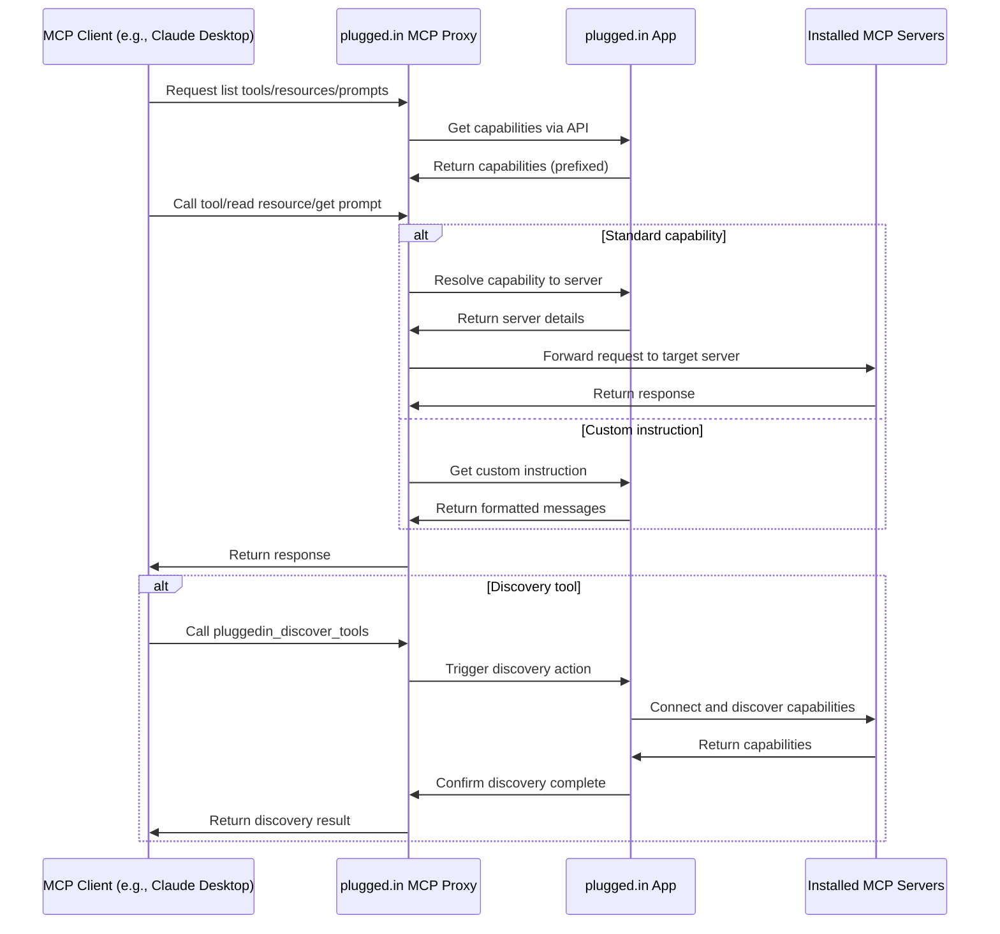

# plugged.in App

<div align="center">
  
  <h3>The Crossroads for AI Data Exchanges</h3>
  <p>A unified management interface for all your MCP servers</p>

  [](https://github.com/VeriTeknik/pluggedin-app/stargazers)
  [](LICENSE)
  [](https://nextjs.org/)
  [](https://modelcontextprotocol.io/)
</div>

## 📋 Overview

The plugged.in App is a comprehensive web application for managing Model Context Protocol (MCP) servers. It works in conjunction with the [plugged.in MCP Proxy](https://github.com/VeriTeknik/pluggedin-mcp) to provide a unified interface for discovering, configuring, and utilizing AI tools across multiple MCP servers.

This application enables seamless integration with any MCP client (Claude, Cline, Cursor, etc.) while providing advanced management capabilities through an intuitive web interface.

## ✨ Key Features

- **Multi-Workspace Support**: Switch between different sets of MCP configurations to prevent context pollution
- **Interactive Playground**: Test and experiment with your MCP tools directly in the browser
- **Tool Management**: Discover, organize, and manage AI tools from multiple sources
- **Resource & Template Discovery**: View available resources and resource templates for connected MCP servers
- **Custom Instructions**: Add server-specific instructions that can be used as MCP prompts
- **Server Notes**: Add custom notes to each configured MCP server
- **Extensive Logging**: Detailed logging capabilities for MCP interactions in the Playground
- **Prompt Management**: Discover and manage prompts from connected MCP servers
- **Expanded Discovery**: Search for MCP servers across GitHub, Smithery, and npmjs.com
- **Self-Hostable**: Run your own instance with full control over your data

## 🚀 Quick Start with Docker

The easiest way to get started with the plugged.in App is using Docker Compose:

```bash
# Clone the repository
git clone https://github.com/VeriTeknik/pluggedin-app.git
cd pluggedin-app

# Set up environment variables
cp .env.example .env
# Edit .env with your specific configuration

# Start the application with Docker Compose
docker compose up --build -d
```

Then open http://localhost:12005 in your browser to access the plugged.in App.

## 🔌 Connecting MCP Clients

### Prerequisites

- The plugged.in App running (either self-hosted or at https://plugged.in)
- An API key from the plugged.in App (available in the API Keys page)
- The plugged.in MCP Proxy installed

### Claude Desktop Configuration

```json
{
  "mcpServers": {
    "pluggedin": {
      "command": "npx",
      "args": ["-y", "@pluggedin/mcp-proxy@latest"],
      "env": {
        "PLUGGEDIN_API_KEY": "YOUR_API_KEY",
        "PLUGGEDIN_API_BASE_URL": "http://localhost:12005" // For self-hosted instances
      }
    }
  }
}
```

### Cursor Configuration

For Cursor, you can use command-line arguments:

```bash
npx -y @pluggedin/mcp-proxy@latest --pluggedin-api-key YOUR_API_KEY --pluggedin-api-base-url http://localhost:12005
```

## 🏗️ System Architecture

The plugged.in ecosystem consists of two main components:



## 💻 Production Deployment

### System Requirements

- Node.js v18+ (recommended v20+)
- PostgreSQL 15+
- PNPM package manager
- Nginx web server (for production deployments)
- Systemd (for service management)

### Production Setup

1. Clone the repository:
   ```bash
   git clone https://github.com/VeriTeknik/pluggedin-app.git /home/pluggedin/pluggedin-app
   cd /home/pluggedin/pluggedin-app
   ```

2. Install dependencies:
   ```bash
   pnpm install
   ```

3. Set up environment variables:
   ```bash
   cp .env.example .env
   # Edit .env with your specific configuration
   ```

4. Run database migrations:
   ```bash
   pnpm db:migrate:auth
   pnpm db:generate
   pnpm db:migrate
   ```

5. Build the application for production:
   ```bash
   NODE_ENV=production pnpm build
   ```

6. Create a systemd service file at `/etc/systemd/system/pluggedin.service`:
   ```ini
   [Unit]
   Description=plugged.in Application Service
   After=network.target postgresql.service
   Wants=postgresql.service

   [Service]
   User=pluggedin
   Group=pluggedin
   WorkingDirectory=/home/pluggedin/pluggedin-app
   ExecStart=/usr/bin/pnpm start
   Restart=always
   RestartSec=10
   StandardOutput=append:/var/log/pluggedin/pluggedin_app.log
   StandardError=append:/var/log/pluggedin/pluggedin_app.log
   Environment=PATH=/usr/bin:/usr/local/bin
   Environment=NODE_ENV=production
   Environment=PORT=12005

   [Install]
   WantedBy=multi-user.target
   ```

7. Set up Nginx as a reverse proxy:
   ```nginx
   # HTTPS Server
   server {
       listen 443 ssl;
       server_name your-domain.com;

       # SSL configuration
       ssl_certificate /etc/letsencrypt/live/your-domain.com/fullchain.pem;
       ssl_certificate_key /etc/letsencrypt/live/your-domain.com/privkey.pem;

       # Next.js static files
       location /_next/static/ {
           alias /home/pluggedin/pluggedin-app/.next/static/;
           expires 365d;
           add_header Cache-Control "public, max-age=31536000, immutable";
       }

       # Proxy settings for Node.js application
       location / {
           proxy_pass http://localhost:12005;
           proxy_http_version 1.1;
           proxy_set_header Upgrade $http_upgrade;
           proxy_set_header Connection 'upgrade';
           proxy_set_header Host $host;
           proxy_cache_bypass $http_upgrade;
       }
   }

   # HTTP redirect to HTTPS
   server {
       listen 80;
       server_name your-domain.com;
       return 301 https://$host$request_uri;
   }
   ```

8. Enable and start the service:
   ```bash
   sudo systemctl daemon-reload
   sudo systemctl enable pluggedin.service
   sudo systemctl start pluggedin.service
   ```

### Security Considerations

**MCP Server Sandboxing (Linux/Ubuntu)**

The plugged.in App automatically wraps the execution of STDIO MCP servers with `firejail --quiet` when running on a Linux system. This utilizes Firejail's default security profile to restrict the server's capabilities, notably limiting filesystem access.

To enable this security feature, install Firejail:

```bash
sudo apt update && sudo apt install firejail
```

## 🔄 Cloud vs. Self-Hosted

| Feature | Self-Hosted | Cloud (plugged.in) |
|---------|------------|-------------------|
| Cost | Free | Free tier available |
| Data Privacy | Full control | Server-side encryption |
| Authentication | Optional | Built-in |
| Session Context | Basic | Enhanced |
| Hosting | Your infrastructure | Managed service |
| Updates | Manual | Automatic |
| Latency | Depends on your setup | Optimized global CDN |

## 🧩 Integration with plugged.in MCP Proxy

The plugged.in App is designed to work seamlessly with the [plugged.in MCP Proxy](https://github.com/VeriTeknik/pluggedin-mcp), which provides:

- A unified interface for all MCP clients
- Tool discovery and reporting
- Request routing to the appropriate MCP servers
- Support for the latest MCP specification

## 📚 Related Resources

- [plugged.in MCP Proxy Repository](https://github.com/VeriTeknik/pluggedin-mcp)
- [Model Context Protocol (MCP) Specification](https://modelcontextprotocol.io/)
- [Claude Desktop Documentation](https://docs.anthropic.com/claude/docs/claude-desktop)
- [Cline Documentation](https://docs.cline.bot/)

## 🤝 Contributing

Contributions are welcome! Please feel free to submit a Pull Request.

## 📄 License

This project is licensed under the MIT License - see the [LICENSE](LICENSE) file for details.

## 🔮 Roadmap

The plugged.in project is actively developing several exciting features:

- **Testing Infrastructure**: Comprehensive test coverage for core functionality
- **Playground Optimizations**: Improved performance for log handling
- **Embedded Chat (Phase 2)**: Generate revenue through embeddable AI chat interfaces
- **AI Assistant Platform (Phase 3)**: Create a social network of specialized AI assistants
- **Privacy-Focused Infrastructure (Phase 4)**: Dedicated RAG servers and distributed GPU services
- **Retrieval-Augmented Generation (RAG)**: Integration with vector databases like Milvus
- **Collaboration & Sharing**: Multi-user sessions and embeddable chat widgets
