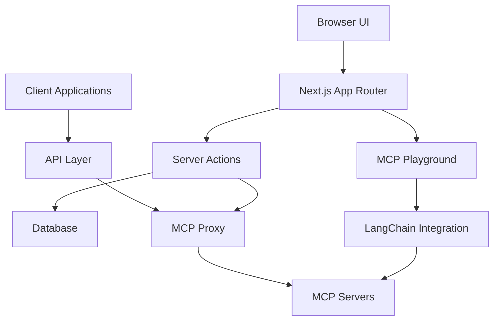
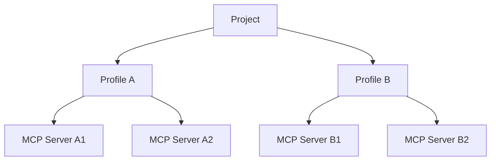
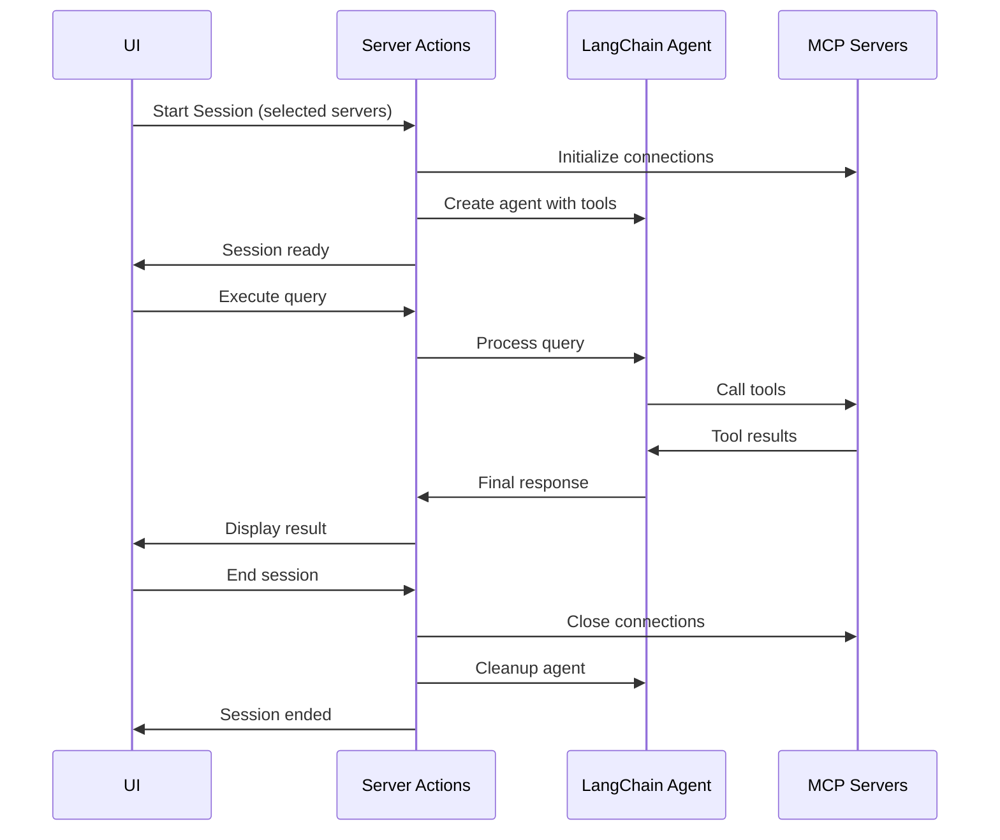

# Plugged.in System Patterns

## Architecture

The Plugged.in application follows a modular architecture based on Next.js App Router:



### Key Components

1. **Next.js App Router**: Manages routing and page rendering
2. **Server Actions**: Handle server-side operations with direct database access
3. **API Layer**: Provides API endpoints for MCP clients
4. **MCP Proxy**: Routes requests to appropriate MCP servers
5. **Database**: PostgreSQL with Drizzle ORM
6. **MCP Playground**: Testing interface using LangChain to convert MCP servers to tools

## Data Models

### Core Entities

1. **Projects**: Top-level organization unit
2. **Profiles** (Workspaces): Environments within projects
3. **MCP Servers**: Configurations for MCP servers
4. **API Keys**: Authentication tokens for API access

### Relationships


## Design Patterns

### Workspace Isolation

Each profile (workspace) has its own set of MCP servers, ensuring isolation between different environments or use cases:



### Server Actions Pattern

Server-side operations use Next.js server actions with direct database access:

```typescript
'use server';

export async function someAction(arg1, arg2) {
  // Database operations
  const result = await db.query...
  
  // Return result to client
  return { success: true, data: result };
}
```

### MCP Server Management Pattern

MCP servers are configured and managed through a consistent interface:

1. **STDIO Servers**: Executed as child processes via command, args, and environment variables
2. **SSE Servers**: Connected via HTTP to a specified URL endpoint

```typescript
// STDIO Server Configuration
{
  name: "File System",
  type: "STDIO",
  command: "npx",
  args: ["-y", "@modelcontextprotocol/server-filesystem", "."],
  env: {},
  status: "ACTIVE"
}

// SSE Server Configuration
{
  name: "External Service",
  type: "SSE",
  url: "https://example.com/mcp-server",
  status: "ACTIVE"
}
```

### MCP Playground Pattern

The MCP Playground follows a session-based pattern for testing MCP servers:

1. **Session Initialization**: 
   - Select MCP servers to test
   - Configure LLM parameters
   - Convert MCP servers to LangChain tools
   - Create ReAct agent with tools

2. **Query Execution**:
   - Send natural language query to agent
   - Agent determines tools to use
   - Tools invoke MCP server functionality
   - Agent provides response based on tool outputs

3. **Session Cleanup**:
   - Properly close MCP server connections
   - Release resources



## Implementation Patterns

### Database Operations

Database operations use Drizzle ORM with PostgreSQL:

```typescript
// Query example
const results = await db.query.someTable.findMany({
  where: eq(someTable.field, value),
  orderBy: desc(someTable.createdAt)
});

// Insert example
await db.insert(someTable).values({
  field1: value1,
  field2: value2
});
```

### Content Processing

Handling complex content returned by MCP tools:

```typescript
function safeProcessContent(content: any): string {
  if (typeof content === 'string') {
    return content;
  }
  
  if (typeof content === 'object') {
    // Special handling for common patterns
    if (content.type === 'text' && content.text) {
      return content.text;
    }
    
    // Fallback to JSON
    return JSON.stringify(content);
  }
  
  return String(content);
}
```

### Error Handling

Consistent error handling pattern for server actions:

```typescript
try {
  // Operation logic
  return { success: true, data };
} catch (error) {
  console.error('Operation failed:', error);
  return { 
    success: false, 
    error: error instanceof Error ? error.message : 'Unknown error' 
  };
}
```

## UI Patterns

### Card-Based Layout

Information and controls are organized in card components:

```tsx
<Card>
  <CardHeader>
    <CardTitle>Component Title</CardTitle>
    <CardDescription>Component description</CardDescription>
  </CardHeader>
  <CardContent>
    {/* Main content */}
  </CardContent>
  <CardFooter>
    {/* Actions */}
  </CardFooter>
</Card>
```

### Form Pattern

Forms use React Hook Form with Zod validation:

```tsx
const form = useForm({
  resolver: zodResolver(schema),
  defaultValues: {
    field1: "",
    field2: ""
  }
});

<Form {...form}>
  <form onSubmit={form.handleSubmit(onSubmit)}>
    <FormField
      control={form.control}
      name="field1"
      render={({ field }) => (
        <FormItem>
          <FormLabel>Field 1</FormLabel>
          <FormControl>
            <Input {...field} />
          </FormControl>
          <FormMessage />
        </FormItem>
      )}
    />
    <Button type="submit">Submit</Button>
  </form>
</Form>
```

### Chat Interface Pattern

Chat uses a message-based display with role-based styling:

```tsx
{messages.map((message, index) => (
  <div 
    key={index}
    className={message.role === 'human' ? 'justify-end' : 'justify-start'}
  >
    <div className={getMessageStyle(message.role)}>
      <div className="whitespace-pre-wrap">{message.content}</div>
    </div>
  </div>
))}
```
