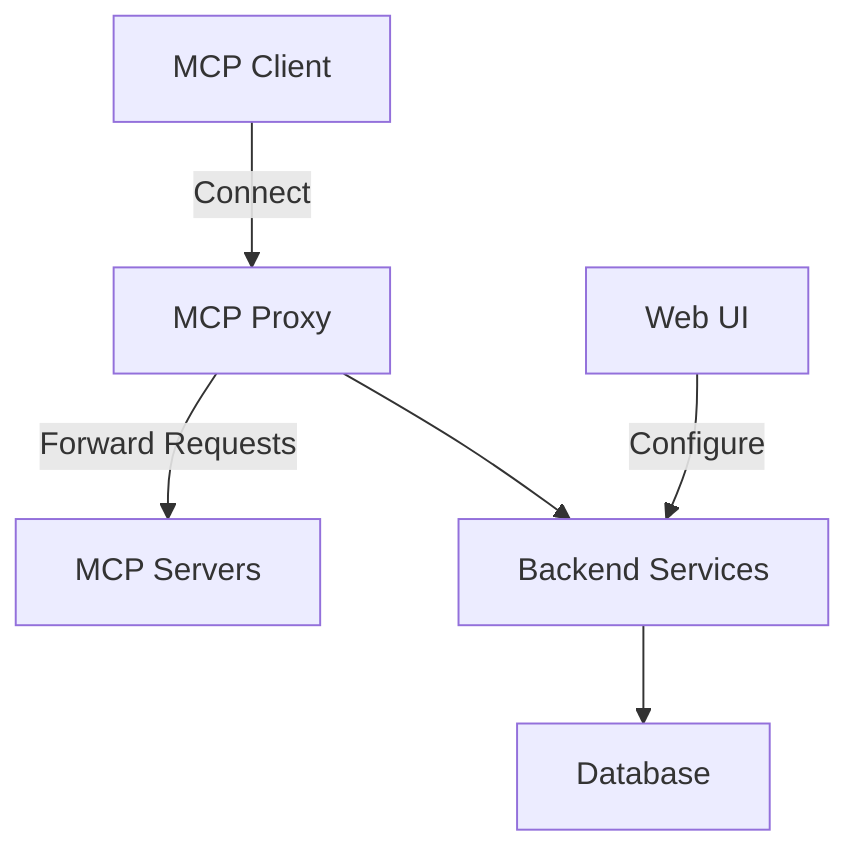
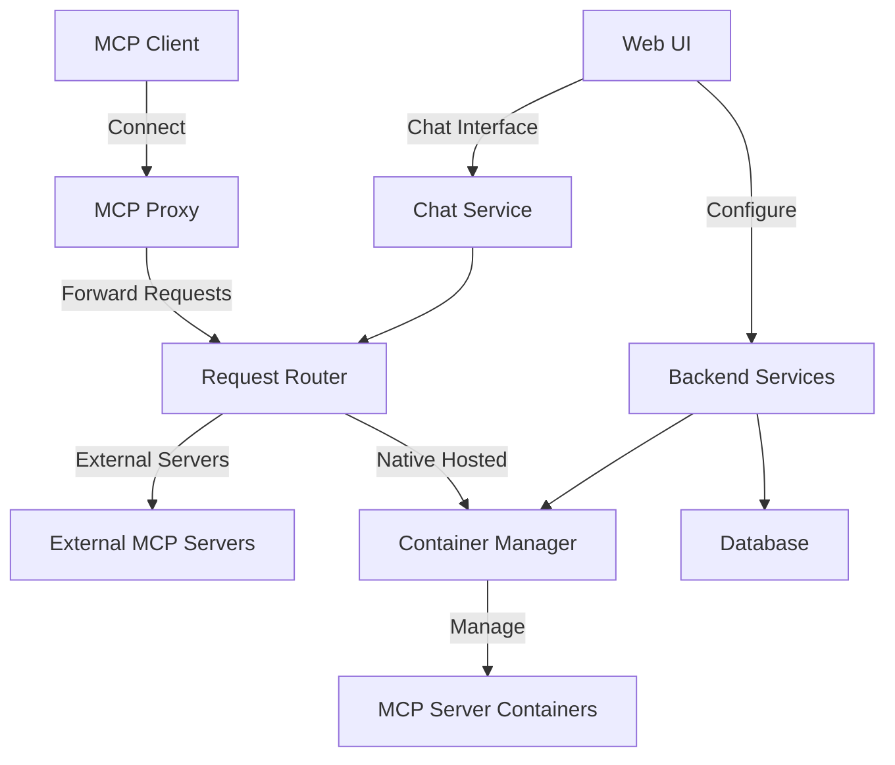
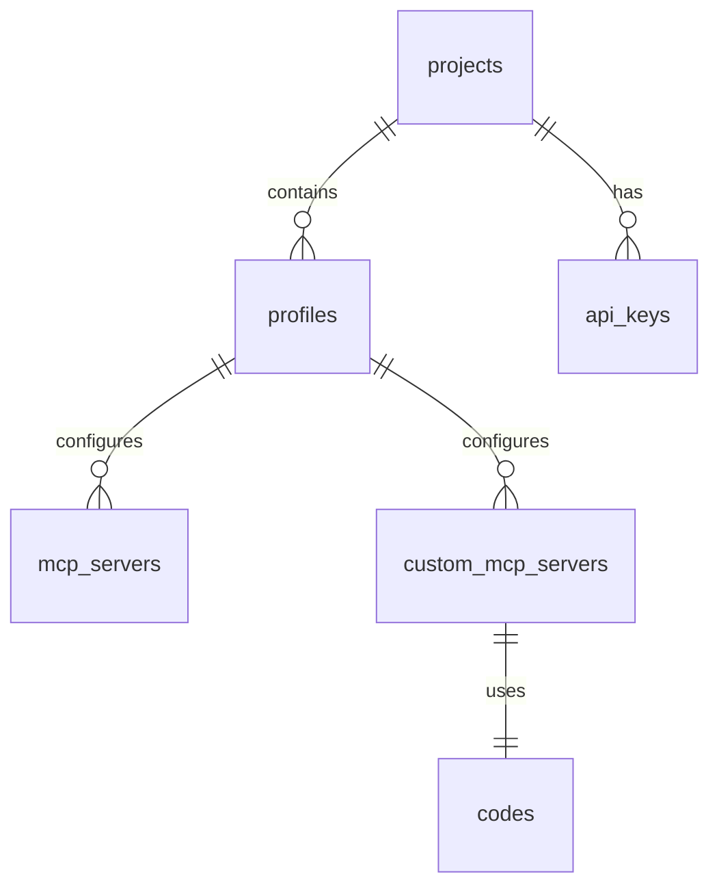

# Plugged.in System Patterns

## System Architecture

Plugged.in follows a multi-tiered architecture with several key components:

1. **Frontend Interface**: Next.js-based web application providing the GUI
2. **Backend Services**: Server-side actions and API endpoints
3. **Database Layer**: PostgreSQL database with Drizzle ORM
4. **MCP Proxy**: Currently, the system acts as a proxy between MCP clients and MCP servers
5. **MCP Servers**: External servers managed by the application

## Evolution to Native Hosting

The planned architecture adds direct hosting capabilities:

## Key Design Patterns

### 1. Workspace Isolation Pattern

Each workspace (profile) is isolated with its own set of:
- MCP server configurations
- API keys
- Tool access controls

This ensures that contexts remain separate between different projects or domains.

### 2. Server Type Abstraction

The system abstracts different types of MCP servers:
- **STDIO**: Command-line based servers using standard input/output
- **SSE**: Server-Sent Events based servers accessed via HTTP

This abstraction allows for unified management regardless of the server's implementation.

### 3. Database Schema Design

The schema design supports multi-tenant operations with projects containing multiple profiles (workspaces).

### 4. Server Management Pattern

The current proxy pattern will evolve to include direct server management:
- Container-based isolation for security
- Resource allocation and monitoring
- Status tracking and lifecycle management

### 5. Tool Aggregation Pattern

Tools from multiple MCP servers are aggregated and presented as a unified set to clients:
- Deduplication of identical tools
- Consistent naming and parameter handling
- Tool routing to the appropriate server

## Component Relationships

1. **Projects & Profiles**: Projects contain multiple profiles (workspaces)
2. **Profiles & Servers**: Each profile can configure multiple MCP servers
3. **Servers & Tools**: Servers expose tools that are aggregated by the system
4. **API Keys & Access**: API keys control access to specific projects

## Evolution Strategy

The transition from proxy to native hosting will follow these patterns:

1. **Additive Changes**: Add native hosting capabilities without removing proxy functionality
2. **Gradual Migration**: Allow users to migrate servers one at a time
3. **Transparent Routing**: Route requests to either proxied or native servers transparently
4. **Incremental Enhancement**: Add container management capabilities incrementally 